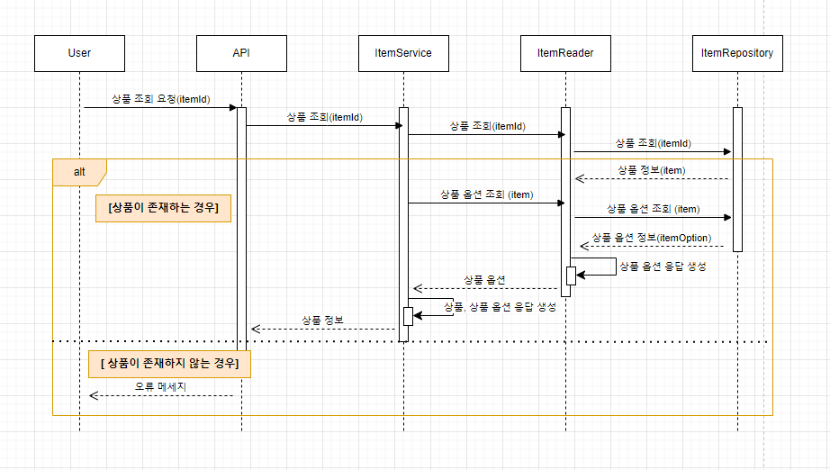
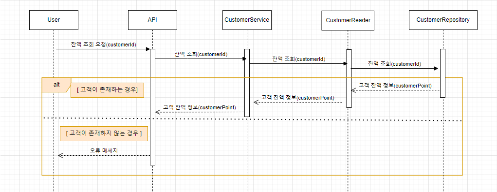
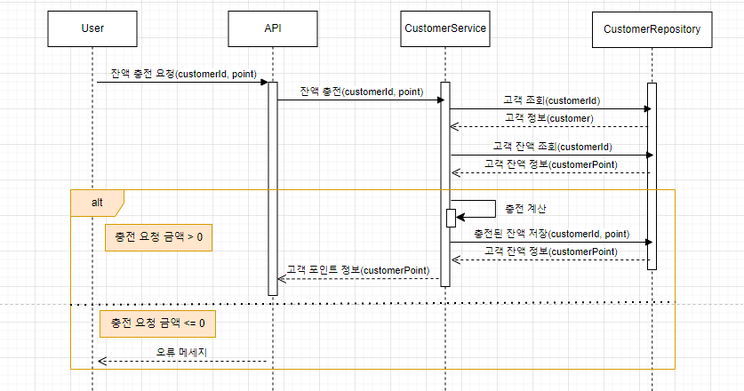
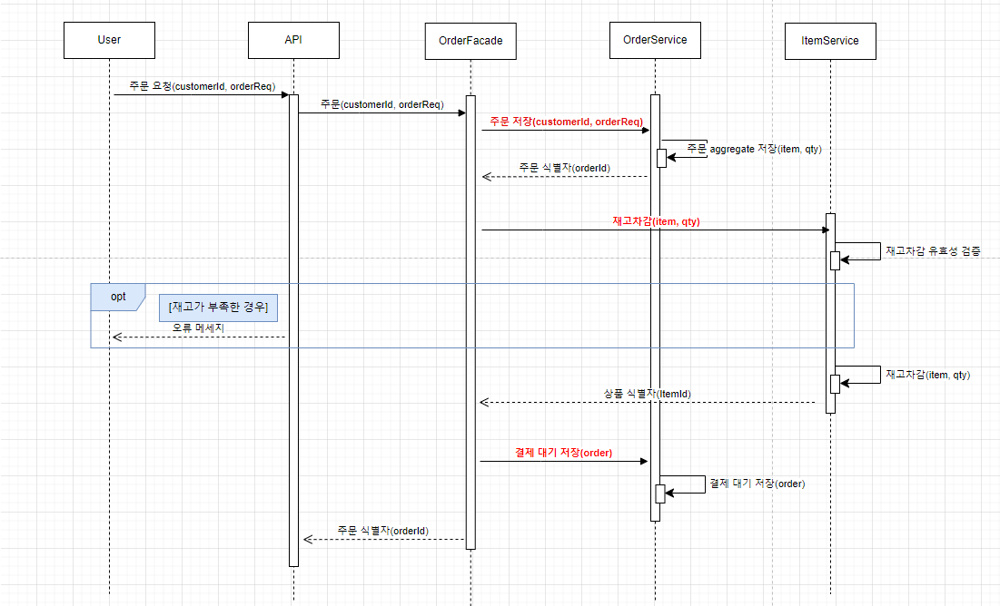
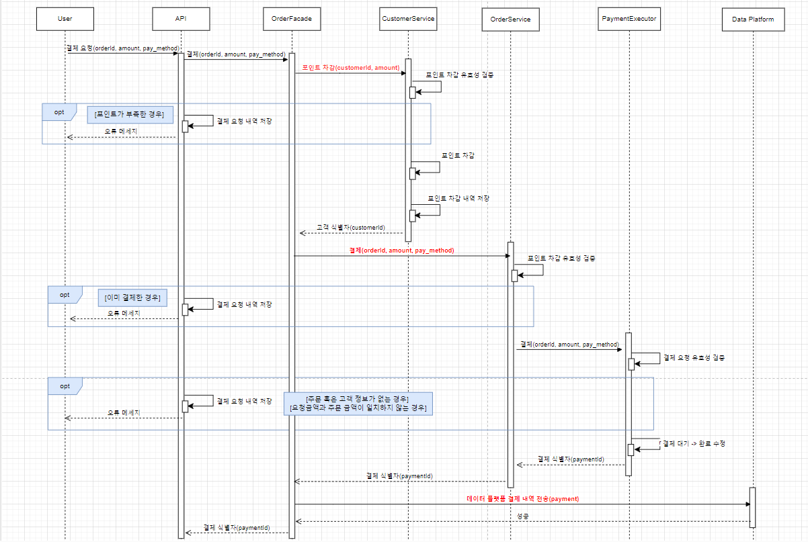
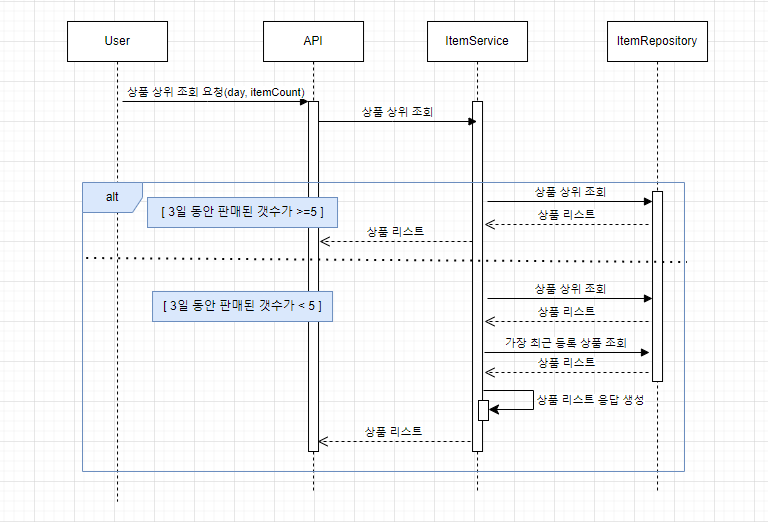
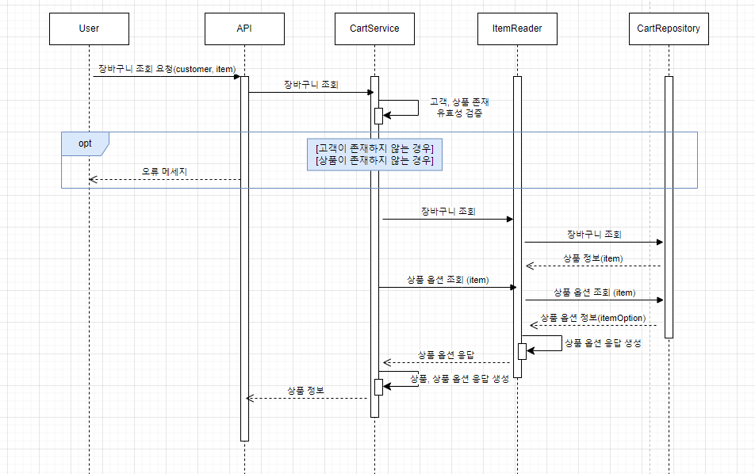
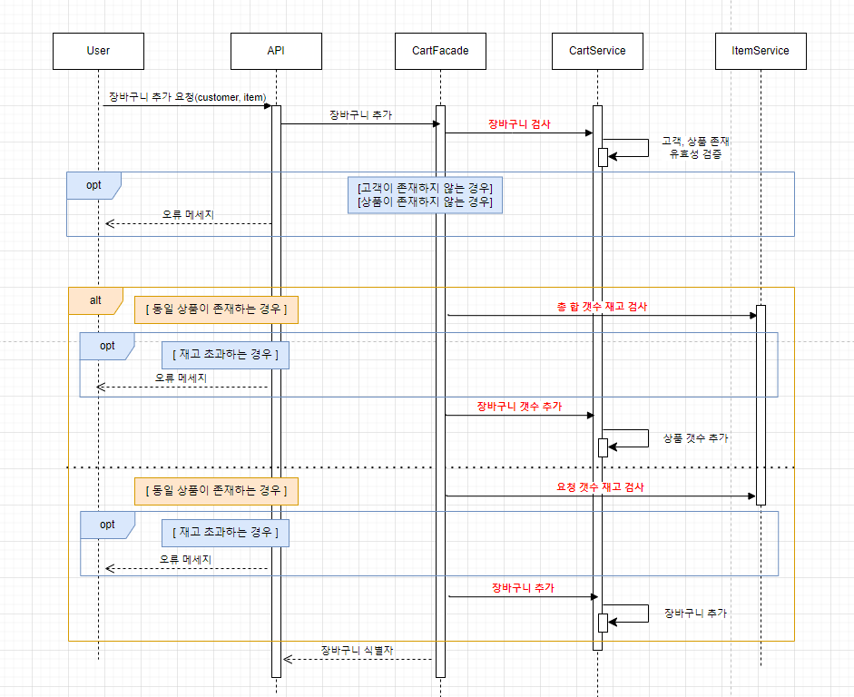
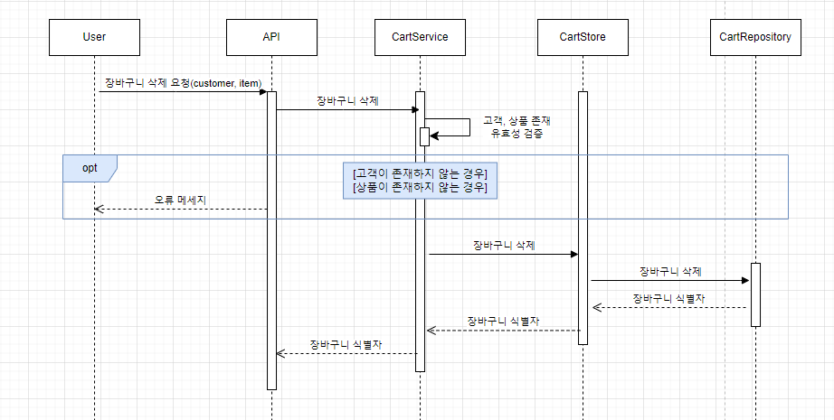

# 시퀀스 다이어그램

9개의 API에 해당하는 시퀀스 다이어그램을 생성합니다.

## 1. 상품 조회 시퀀스 다이어그램

## 2. 잔액 조회 시퀀스 다이어그램

## 3. 포인트 충전 시퀀스 다이어그램

## 4. 주문 시퀀스 다이어그램

## 5. 결제 시퀀스 다이어그램

## 6. 상위 상품 조회 시퀀스 다이어그램

## 7. 장바구니 조회 시퀀스 다이어그램

## 8. 장바구니 추가 시퀀스 다이어그램

## 9. 장바구니 삭제 시퀀스 다이어그램

