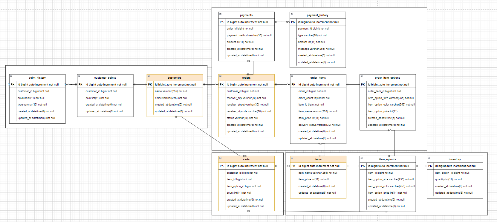

# ecommerce ERD

### Description

- DDD 기반으로 총 4개의 Aggregate로 구성되며 Root는 `customers(고객)`, `orders(주문)`, `item(상품)`, `carts(장바구니)` 입니다.

### customers

- `customers`는 고객 `Aggregate Root`입니다.
- 고객은 결제를 위해 포인트를 관리하는 `customer_points`를 가집니다.
- 포인트 충전, 차감 시 이력을 관리하는 `point_history`를 가집니다.
- `customers`는 락을 위해 포인트를 정규화한 `customer_point`와 `1:1` 관계를 가지며, 
`customer_point`는 포인트 충전/차감마다 이력을 쌓으므로 `point_history`와 `1:N` 관계를 가집니다. 

### items

- `items`는 상품 `Aggregate Root`입니다.
- 상품마다 옵션을 관리하는 `item_points`를 가집니다.
- 각 상품 옵션은 락으로 재고를 관리하는 `inventory`를 가집니다.
- `items`는 옵션을 가지는 `item_options`와 `1:1` 관계를 가지며, 
`item_options`는 재고를 정규화하여 `inventory`와 `1:1` 관계를 가집니다.

### carts

- `carts`는 장바구니 `Aggregate Root`입니다.
- 장바구니는 `items` 뿐만 아니라 `items_options` 의 식별자를 참조하도록 반정규화했습니다.
- 1개의 테이블로 간편하게 관리하기 위해서입니다. 

### orders

- 'orders'는 주문 `Aggregate Root`입니다.
- 주문의 상품 정보를 관리하는 `order_items`를 가집니다.
- 각 주문 상품마다 옵션들을 관리하는 `order_item_options`를 가집니다.
- 결제를 관리하는 `payments`를 가집니다.
- 결제를 시도할때마다 이력을 관리하는 `payment_history`를 가집니다.
- `orders`는 여러 개의 상품을 가지는 `order_items`와 `1:N` 관계를 가지며, 
`order_items`는 옵션을 가지는 `order_item_options`와 `1:1` 관계를 가집니다.
주문 후 결제는 예외가 발생하여 여러번 시도 할 수 있으므로 `orders`와 `payments`는 `1:N` 관계를 가집니다.
`payments`는 결제를 시도할 때마다 이력이 쌓이므로 `payment_history`와 `1:N` 관계를 가집니다.