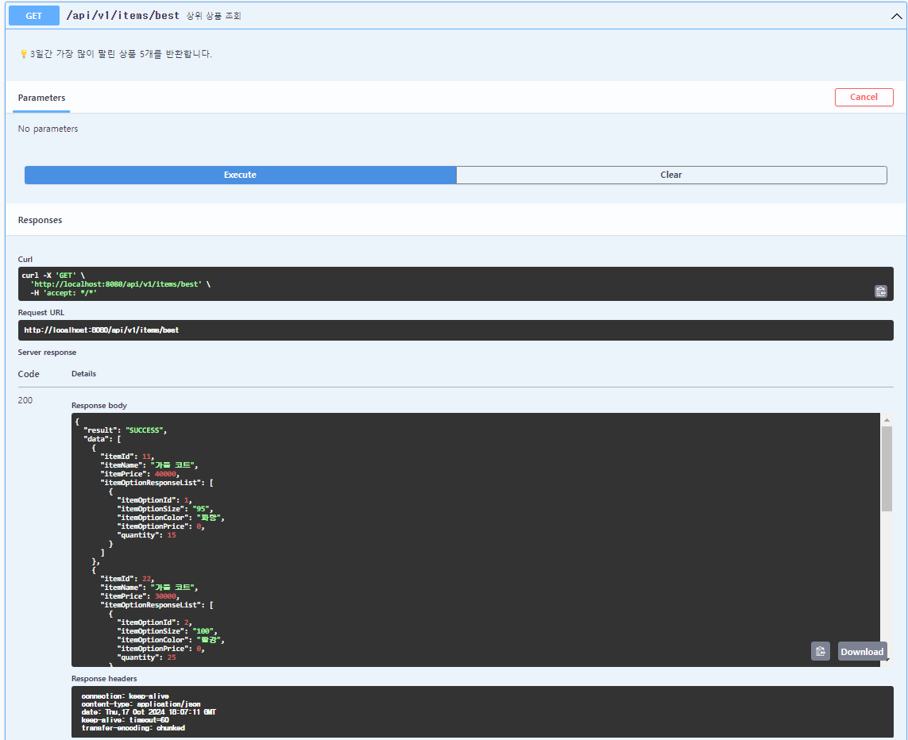
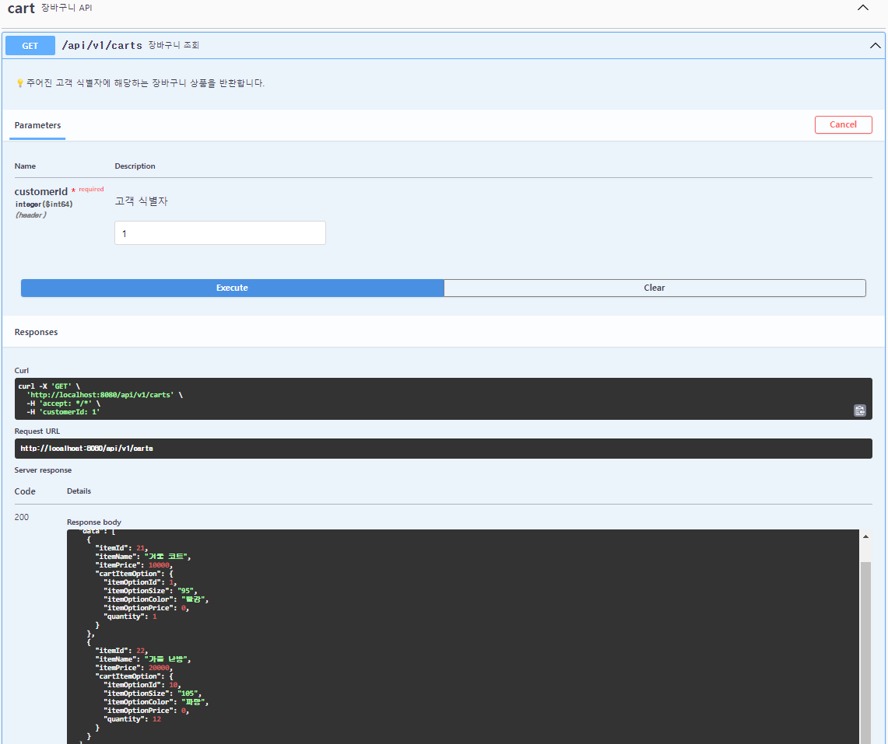
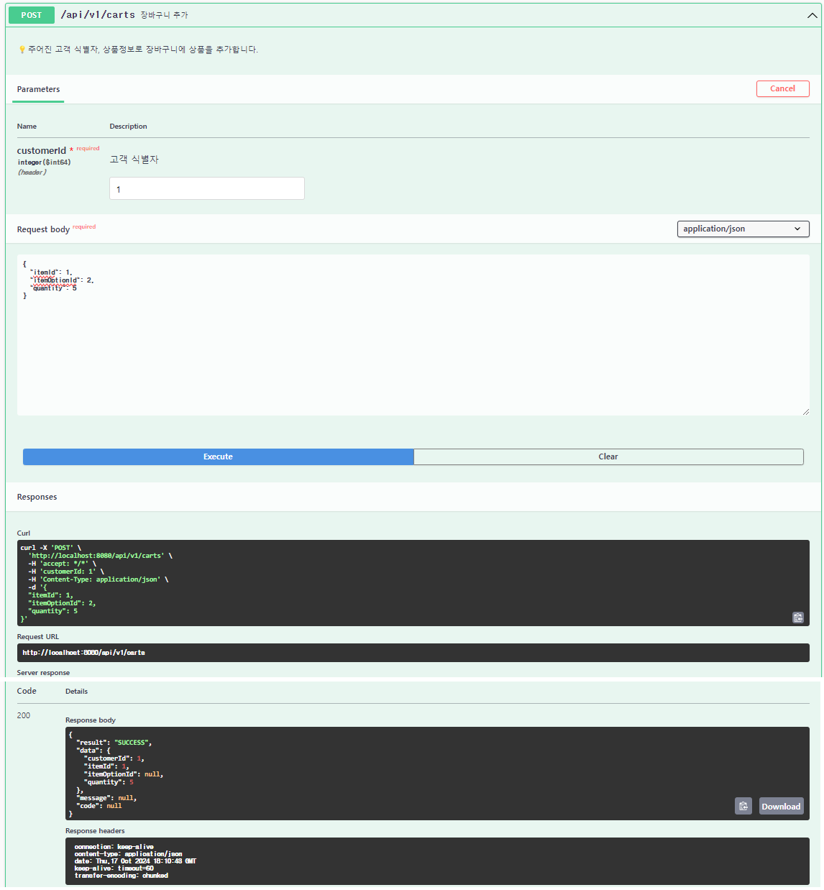
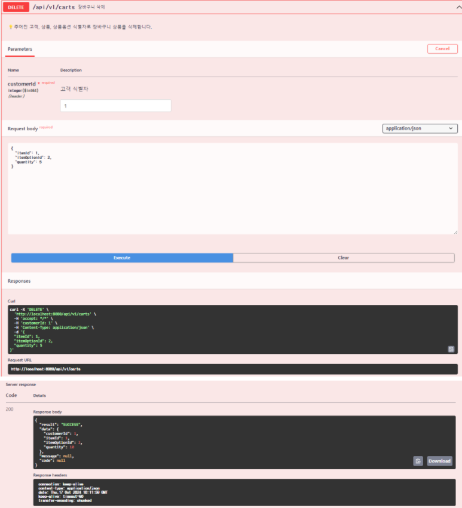
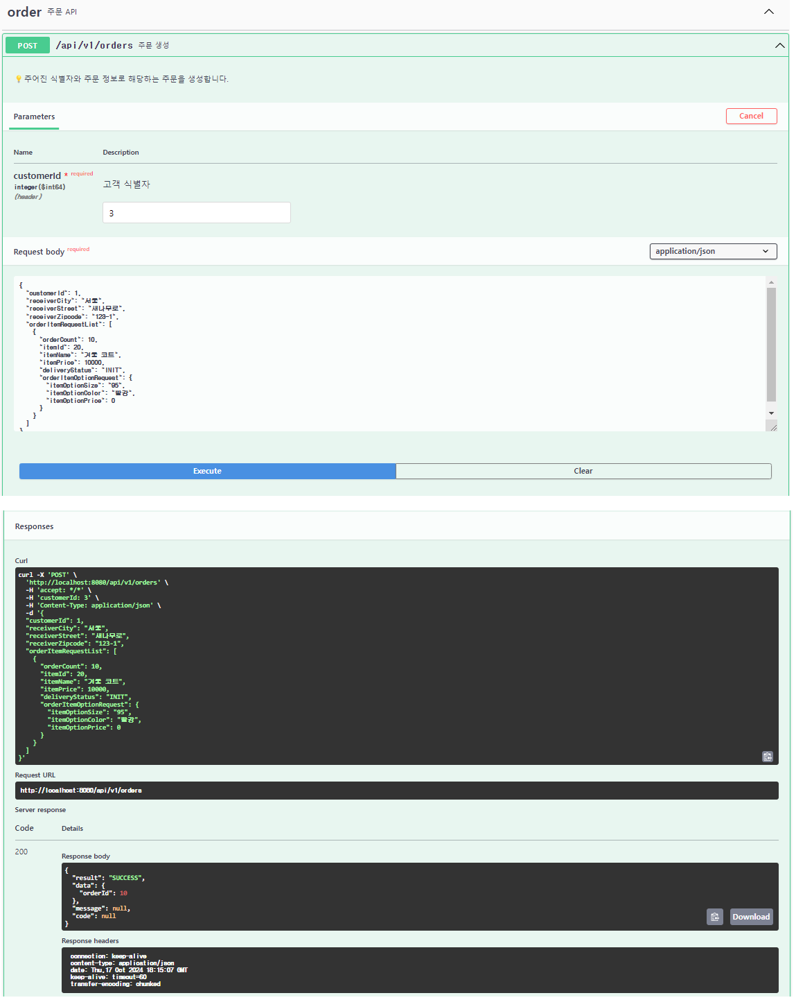
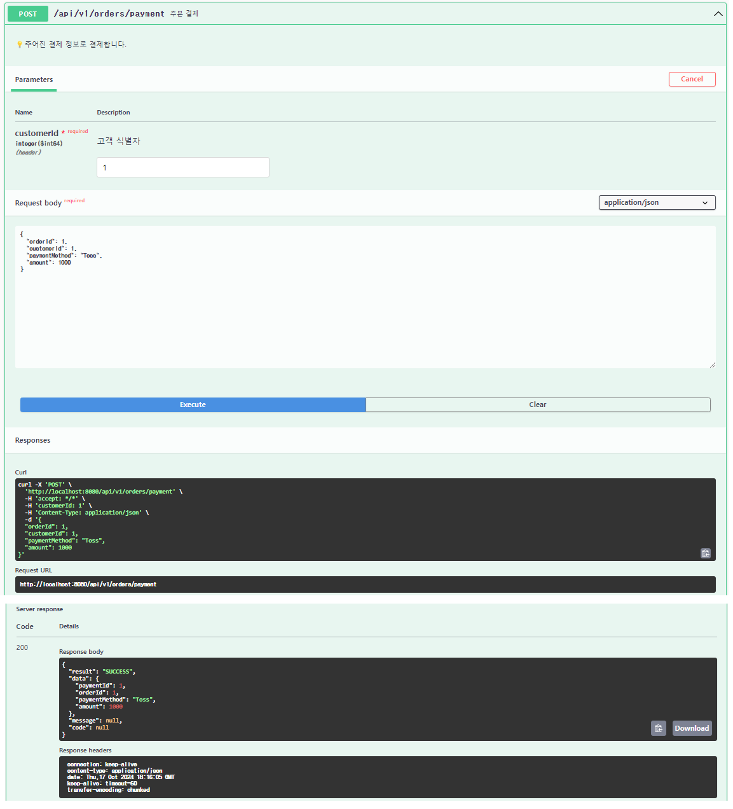
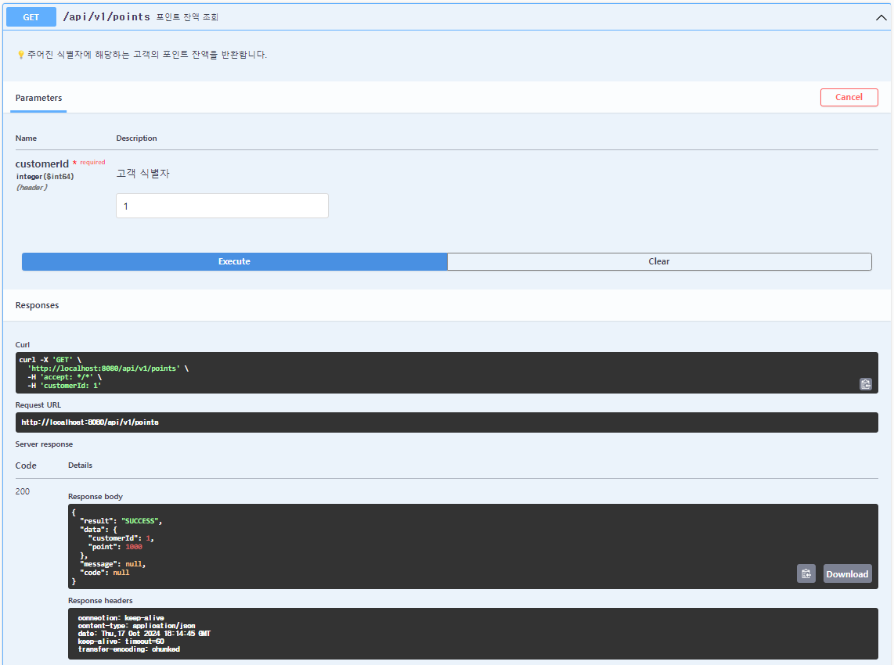
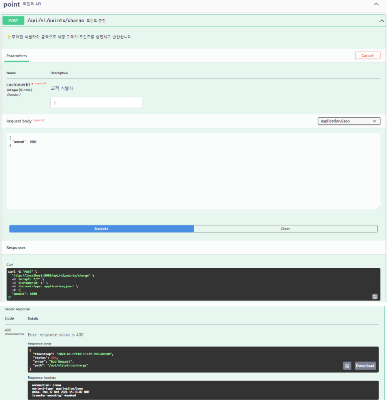

# MockAPI

### 실행 방법

프로젝트를 실행하신 후 http://localhost:8080/swagger-ui/index.html 에 접속하시면 Swagger 문서를 확인할 수 있습니다.

### 상품 API

## 상품조회

## 상위 상품 조회

### 장바구니 API

## 장바구니 조회

## 장바구니 추가

## 장바구니 삭제

### 주문 API

## 주문 생성

## 주문 결제

### 포인트 API

## 포인트 조회

## 포인트 충전

