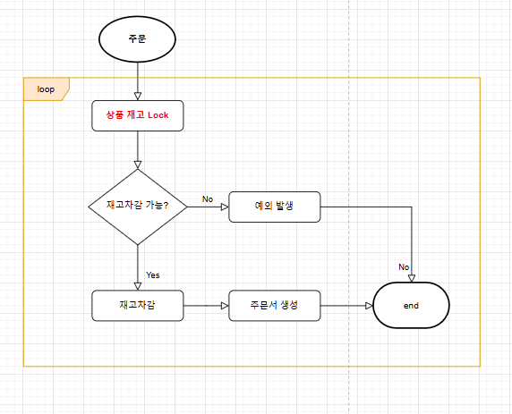
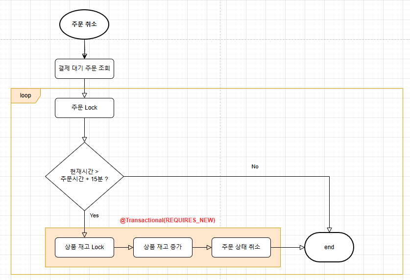
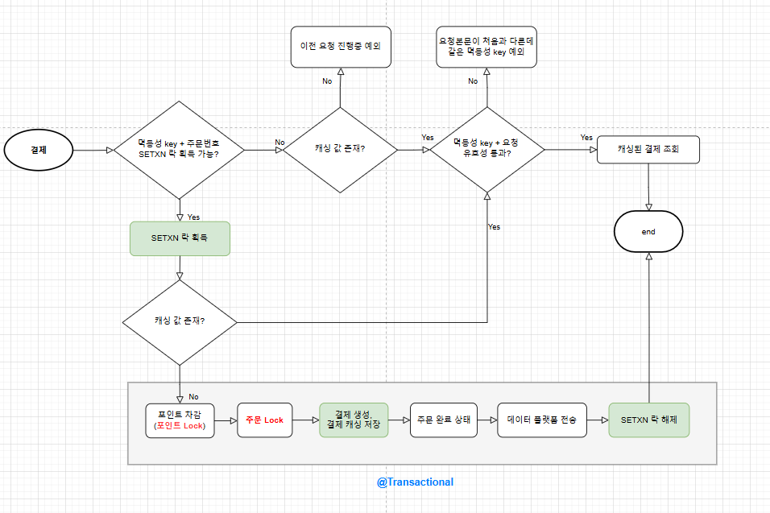
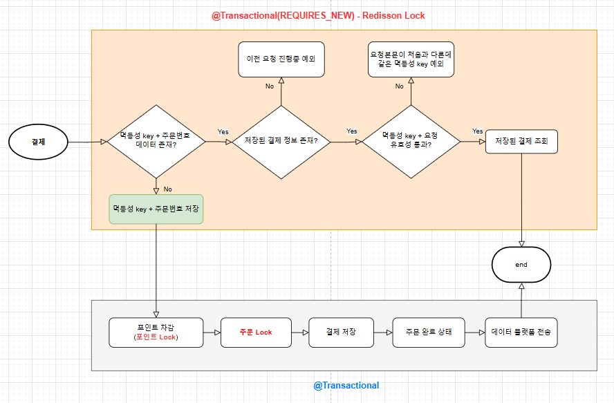

# 동시성 제어하기

## 목표

- 동시성을 이해한다.
- 동시성을 제어하는 다양한 방법을 살펴본다.
- 동시성과 트랜잭션을 고민해 비지니스 로직을 구현한다.

동시성 문제의 모든 방식을 적용, 비교해보면 좋겠지만 제한된 시간으로 다양한 방법의 장/단점을 살펴보고 이번 프로젝트의 중요 기준에 따라 
적용합니다. 동시성 제어 뿐만 아니라 트랜잭션 범위 설정 및 DB 부하를 줄이는 방법도 고민합니다.

## 동시성 문제란?

동시성 문제는 여러 요청이 하나의 자원에 동시에 접근할 때 발생하는 문제입니다. 

대표적으로 `분실 갱신(Lost Update)`이 있으며 좋아요를 2명이 동시에 SELECT 후 UPDATE 하면 2가 아닌 1만 증가하는 현상이 있습니다. 
(SELECT 시 2명이 동일한 갯수의 LIKE를 조회하고 +1을 UPDATE하는 문제) 

데이터의 정합성을 지키기 위해 스레드 간에 자원 접근을 제한하는 `락`으로 해결합니다. 락의 방법으로 비관적 락, 낙관적 락, 
분산 락이 있습니다. 적용하는 대상에 따라 어플리케이션 라이브러리 동기화, DB 락, 인메모리 락 등으로 구분 할 수도 있습니다.

> 데이터 정합성은 각종 트랜잭션으로 변경된 데이터가 변경 전과 후에도 일관된 상태를 유지해야 함을 의미합니다. 
> 따라서 동시성 문제가 예상되는 곳에 트랜잭션 직렬화(serializability)로 트랜잭션 독립(isolation)이 필요합니다. 
> 데이터 정합성이 중요하다고 언급하는 로직은 이미 자원을 점유한 트랜잭션이 있으면 해당 자원에 다른 트랜잭션이 읽기, 쓰기 중 어느것도 
> 접근하지 못하고 강하게 독립되어야 하는 로직입니다

## 동시성 문제 해결 방법

### 어플리케이션 동기화 라이브러리

어플리케이션 수준 동기화는 간단하게 구현이 가능합니다. 예를 들어 `synchronized` 키워드로 하나의 인스턴스 + 멀티 쓰레드 접근을 동기화 
할 수 있습니다. 이에 비해 `reentrantLock`은 공정성 보장, 락 설정/해제 라이브러리를 제공하며 따라서 데드락을 피하기 유리합니다. 
하지만 둘 다 여러 인스턴스에서 들어오는 쓰레드를 동기화 할 수 없습니다.

### 비관적 락

비관적 락은 공정성을 보장하며 데이터 정합성을 강력하게 보장합니다. 락이 걸려 쓰기는 못해도 조회는 가능한 공유락(Read)이 있고 락이 
걸리면 조회도 못하는 배타락(Write)이 있습니다. 배타락은 락을 걸어 자원을 점유하면 동일 자원에 대해 다른 쓰레드는 락으로 해당 자원에 
조회, 쓰기를 모두 할 수 없으므로 DB 부하가 커질 수 있습니다. 불필요한 구간에 락을 걸어 성능이 저하되지 않도록 합니다. 

> DB의 Serializable는 공유락(Shared Lock)을 사용해 락이 걸린 자원은 추가/수정/삭제가 불가능하므로 성능이 심각히 저하되어 
> 실무에서 사용하지 않습니다. 

### 낙관적 락

낙관적 락은 엄밀히 말해 락이 아닌 버전 비교 방식으로 비관 락보다 상대적으로 성능이 좋습니다. 하지만 공정성을 보장하지 않고 비교를 위한 
버전 칼럼과 실패 시 재시도를 구현해야 하므로 더 많은 작업과 전략이 필요합니다. 재시도의 시간과 횟수가 길어질수록 부하도 증가하므로 
주의합니다. 따라서 충돌이 많이 일어나거나 데이터 정합성이 중요하면 비관적 락을, 충돌이 적게 일어나거나 순서가 크게 중요하지 않으면 
낙관적 락을 선택합니다.

### 분산 락

분산 락은 테이블에 락을 걸지 않고 특정 문자열을 획득/반납하는 잠금입니다. key-value를 사용하는 인메모리 Redis 구현에 적합하며
Simple, Spin, Pub/Sub 3가지 방식이 있습니다. Simple 방식은 락 획득을 실패하면 로직을 실행하지 않아 재시도가 필요하고, 
Spin(Lettuce) 방식은 락 획득 시까지 지속적인 재시도로 네트워크 비용 및 쓰레드 점유 문제가 있습니다. 
Pub/Sub(Redisson) 방식은 락을 획득할 때까지 대기하므로(timeout 존재) 더 안전하게 사용할 수 있습니다.

DB에서도 분산 락(Named Lock)을 사용할 수 있습니다. 만약 MySQL을 사용해왔다면 Zookeeper, Redis 등의 추가 구축 비용이 들지 않고 
동시성 문제를 해결할 수 있습니다. 하지만 커넥션 풀을 별도로 관리해야하며 DB에 부하를 주기 때문에 DB와 격리된 
다른 구현체를 사용하는 경우가 많습니다.

이외에 락을 조합해서 사용할 수 있습니다. 예를 들어 분산 락 + DB 낙관 락입니다. 1차로 분산 락을 이용하되 timeout 등의 상황에 대비해 
낙관 락으로 재시도를 하도록 2차 안전 장치를 만들 수 있습니다.

## 어떤 락을 사용 할 것인가?

락 선정 기준은 `분산 환경`, `공정성(재시도 최소화)`, `DB 이외 락 구현` 입니다. 

- 분산 환경 이므로 어플리케이션 라이브러리는 제외합니다.
- 재고 차감은 갑자기 주문이 몰릴 경우 수많은 재고 차감 충돌을 대비하여 순서대로 공정성을 지킬 수 있는 `비관적 락`을 사용합니다.
- 포인트는 돈을 관리하기 때문에 정합성이 중요하므로 `비관적 락`을 사용합니다.
- 결제 멱등성 체크는 실제 결제 로직 이전으로 비지니스 로직과 분리될 수 있고 DB에 부하를 줄이기 위해 DB 락을 걸지 않는 `Redisson`을 사용합니다.

## 동시성 제어 적용

### 포인트 충전/사용
- 결제는 정합성이 중요하므로 `비관적 락`을 사용해 트랜잭션 독립성을 최대한 보장합니다.
- 포인트 락을 위한 별도의 테이블이 있으며 충전/사용이 동시에 일어나는 경우는 많지 않을 것으로 보입니다.

### 주문

#### 플로우
- 주문을 요청하면 상품 재고를 확인해 재고를 차감하고 주문서를 생성합니다.

#### 동시성 이슈 구간
- 인기 상품을 동시에 많은 사람이 주문 할 경우 동시성 문제가 발생할 수 있습니다. 또한 어드민 상품 재고 추가와 주문의 재고 차감이 겹치는 
동시에 일어날 수 있습니다.

#### 해결책
- 주문 시, 인기 상품의 재고 차감 충돌이 많을 것을 대비하고 공정성을 지킬 수 있는 `비관적 락`을 사용합니다. 
현재 주문 프로세스는 재고 차감과 주문서 생성 2가지만 있기 때문에 트랜잭션 범위가 작습니다. 따라서 일반 상품들은 재시도 2회 이하로 
낙관적 락을 시도하고 중요 상품들은 비관적 락을 사용하는 방법도 고려할 수 있습니다.

### 주문 취소

#### 플로우
- 스케쥴러로 확인해 15분 동안 결제하지 않은 주문 건은 취소와 함께 재고가 복구됩니다. 

#### 동시성 이슈 구간
- 주문 결제와 주문 취소가 겹치는 동시성 문제가 날 수 있습니다. 결제 완료로 주문 완료 상태가 되는 동시에
주문 취소 배치로 주문이 취소되면서 재고가 증가할 수 있습니다.

#### 해결책 
- 조회 시 주문에 `비관적 락`을 걸어 재고가 복구되면서 주문이 결제되는 상황을 예방합니다. 또한 모든 재고 복구를 하나의 
트랜잭션으로 묶으면 부하가 커지므로 `@Transactional(REQUIRES_NEW)`로 각 주문을 신속하게 복구 합니다. 
새로운 트랜잭션 커넥션을 하나 더 생성하기 때문에 DB 자원에 부하를 주지만 케이스가 그렇게 많지 않을 고려해 선택했습니다.

### 결제

### SpinLock 사용

첫째는 Redis `SETNX` 자료구조 활용입니다.

#### 주요 구현 플로우
- 요청이 들어오면 `SETNX`를 활용해 락을 점유합니다.
- 바로 빈 값을 캐싱에 저장 결제를 생성하면 결제 정보 저장을 업데이트하고 마지막에 락을 해제합니다.
- 곧바로 들어온 요청은 락을 획득하지 못해 캐싱값을 확인해 아직 빈 값이면 이전 요청 진행중 예외를 반환합니다.
- 결제가 완료된 후 들어온 요청은 캐싱 값을 반환합니다. 

#### 장점
- `Lettuce`에서 지원하는 `SETNX` 자료구조를 사용 할 수 있습니다.
- 스프링에서 `setIfAbsent`를 사용하면 이미 요청 진행 중인 경우 예외 처리 스펙을 쉽게 구현할 수 있으며 혹은 강제 대기를 걸 수
있습니다. 

#### 단점
- 락 획득을 위해 지속적으로 요청을 보내므로 부하가 커질 수 있으며 retry, timeout 등을 지정해야 하는데
분산 락을 사용하려면 직접 구현 할 부분이 많습니다.

### Redisson 사용

두번째는 Redisson + 멱등성 DB 활용입니다. 

#### 주요 구현 플로우
- 멱등성 검사를 새로운 트랜잭션으로 격리하고 검사 안에 멱등성 데이터를 생성합니다. 
- 중복('따닥') 결제가 발생하면 최초 요청은 멱등성 데이터와 결제 정보를 저장합니다. 
- 두번째 요청은 최초 요청의 멱등성 검사 락이 해제 되고나서야 락을 획득하는데 이때는 아직 결제 
정보가 존재하지 않기 때문에 결제중이라는 예외를 반환합니다.
- 이후 결제가 완료된 후 들어온 요청은 캐싱 값을 반환합니다.

#### 장점
- 락 인터페이스를 지원해 손쉽게 락의 타임 아웃 등의 설정을 할 수 있습니다.
- Pub/Sub 방식으로 락이 해제를 알리면 락을 획득하므로 스핀 락에 비해 부하가 적습니다.

#### 단점
- 단점은 트랜잭션이 격리되어 있기 때문에 이후 포인트 차감, 결제 완료, 주문완료 등에 예외가 발생할 경우 
다시 멱등성 데이터를 삭제하는 보상 처리를 해야합니다.

결제에서 `Redisson` 방법을 택한 이유는 스핀 락에 비해 부하가 적습니다. 비지니스 로직에서 적절한 트랜잭션 범위 설정, 
트랜잭션 실패 이후 보상처리에 대해 고민해 볼 수 있습니다. 또한 AOP를 활용한 재사용, 락 설정/해제가 가능하므로 락과 
트랜잭션 설정 순서의 중요성을 학습할 수 있습니다.
