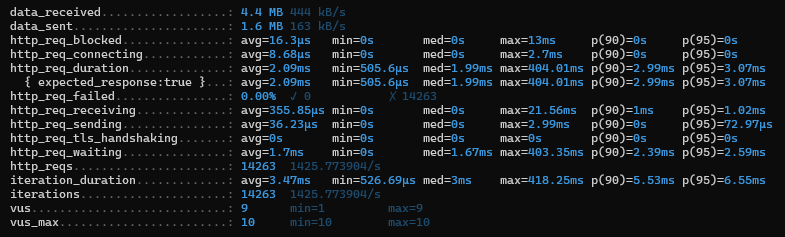
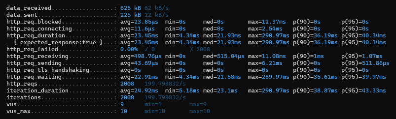
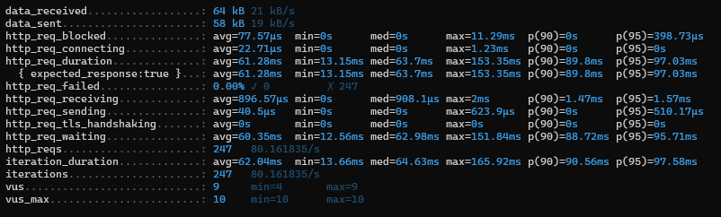
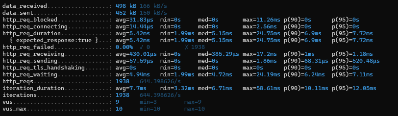

# Redis 활용하기

## 목표

- 캐시를 이해한다.
- 병목 구간을 Redis를 활용해 성능 향상시킨다.

 Redis를 중점으로 생각했습니다. 크게 Redis의 캐시 기술과 DB 대신 메모리 기반의 저장소 사용으로 개선합니다. 

## 캐시란?

캐시란, 나중에 요청될 결과를 미리 저장해두었다가 빠르게 서비스를 해주는 것을 의미합니다. 예를 들어 Factorial의 
`Dynamic programming`이 있습니다. 미리 계산을 해두면 나중에 계산을 또 하지 않아도 됩니다. `4! = 4 * 3!`입니다. 
`3! = 3 * 2!`입니다. 3!을 미리 저장해두고 4!에 이용하면 빠르게 계산 할 수 있습니다.

## 캐시 전략

### Look Aside
요청이 오면 캐시를 먼저 확인해 반환하고 존재하지 않으면 DB에서 조회하여 반환합니다.
캐시에는 DB에서 조회한 데이터를 저장합니다.
- 장점: 캐시에 데이터가 저장되어 있으면 DB에 접근하는 대신 바로 호출하여 부하가 줄어듭니다.
- 단점: 캐시 서버가 다운되면 많은 커넥션이 갑자기 DB에 몰려 과부하가 올 수 있습니다.
- 해결책: DB에서 캐시에 강제로 데이터를 밀어 넣는 캐시 웜업 전략을 사용합니다.

### Read Through
캐시에서만 데이터를 읽습니다. 캐시 미스가 발생하면 DB에서 직접 캐시에 업데이트 합니다.
- 장점: 캐시가 계속 갱신되어 성능이 향상됩니다. 정합성 문제가 없습니다.
- 단점: 초기 캐시 미스가 많아 캐시 효과가 적습니다.

### Write Back
쓰기가 많을 때 사용하며 요청이 오면 캐시에 먼저 저장하고 특정 시점에 DB에 저장합니다.
- 장점: 만약 1초마다 쓰기를 했다면, 일단 캐시에 저장하므로 DB 부하가 줄어듭니다.
- 단점: 캐시에 먼저 저장하므로 장애 발생 시 데이터가 모두 사라질 수 있습니다.
- 해결책: 극단적으로 무거운 데이터나 복구 가능한 데이터일 때 사용합니다.

### Write Around
캐시를 거치지 않고 바로 DB에 저장합니다. 캐싱을 갱신하지 않고 캐시 미스인 경우 DB에서 조회합니다.
- 장점: 저장을 한번만 할 수 있어서 간편합니다.
- 단점: 캐시 데이터와 DB데이터의 정합성이 다를 수 있습니다.

### Write Through
캐시에 저장하고 캐시를 통해 DB에 저장합니다.
- 장점: 캐시는 항상 DB와 동기화 되어 있습니다.
- 단점: 저장을 2번 하므로 성능이 상대적으로 떨어집니다. 
- 해결책: 잘 사용하지 않는 데이터들은 캐시에서 만료 시간을 설정합니다.

보통 Write Around + Look Aside와 Write Around + Read Through 방식을 많이 사용합니다.

## 캐시 적용하기

첫번째는 Write Around와 Look Aside를 활용하여 `인기 상품 조회하기` 를 구현합니다. 캐싱 만료 시간은
`1시간` 으로 설정해, 약 1시간마다 최근 3일간의 최대 판매량을 정렬합니다.

두번째는 캐시 저장소를 활용하여 `결제 멱등성 key, 결과 캐싱하기`를 구현합니다. 중복 결제를 검증하기 위해 사용하는
멱등성 키를 key로, 결제 결과를 value로 관리하여 개선합니다.

### 1. 인기 상품 조회하기

인기 상품 조회는 실시간으로 계속 집계 쿼리 요청을 하면 부하가 많이 걸립니다. 따라서 `30분` 캐싱 전략을 사용해 부하를 줄입니다.

### 주요 구현 
```java
@Cacheable(
        cacheNames = "ItemBestQueryService:getBestItems",
        key = "'getBestItems'",
        cacheManager = "thirtyMinutesCacheManager"
)
public List<ItemBestResponse> getBestItemsRedis() {
    return orderReader.getBestItems();
}
```
- cachenNames: `서비스명:메서드명`을 사용합니다.
- key: 별도의 식별자가 없기 때문에 메서드 이름을 사용합니다.
- cacheManager: `30분` TTL을 설정한 캐시 매니저를 사용합니다.

#### 30분 캐싱 cacheManager 
```java
    @Bean
    public CacheManager thirtyMinutesCacheManager() {
        return RedisCacheManager.builder(connectionFactory)
                .cacheDefaults(thirtyMinutesCache())
                .build();
    }

    private RedisCacheConfiguration thirtyMinutesCache() {
        return RedisCacheConfiguration.defaultCacheConfig()
                .serializeKeysWith(fromSerializer(new StringRedisSerializer()))
                .serializeValuesWith(fromSerializer(new Jackson2JsonRedisSerializer<>(Object.class)))
                .entryTtl(Duration.ofMinutes(THIRTY_MINUTE));
    }
```

### k6 테스트
```java
10초동안 10명의 가상 유저가 인기 상품 조회를 요청합니다.
```

- 캐시를 사용한 경우



- 캐시를 사용하지 않은 경우



### 결과
- 캐시를 사용한 경우 `1425 TPS`, 캐시를 사용하지 않은 경우 `199 TPS`로 캐시를 사용했을 때, 조회에서 압도적인 성능을
보여줍니다.

### 2. 멱등성 key, 결과 캐싱하기
이전에 분산락과 DB를 사용하여 결제를 제어했는데 Redis 저장소를 활용하여 개선합니다. Redis는 싱글 쓰레드이기 때문에
동시성 문제 가능성이 적습니다. 따라서 별도의 락 사용 없이 `setIfAbsent` 자료구조를 활용해 멱등키가 이미 존재하는지 검사할 수 있습니다.
또한 `TTL` 설정이 간편해 `15분` 후에는 같은 멱등성 키로 요청을 허용합니다.

- 분산락 + 멱등성 DB를 이용한 경우


- Redis의 멱등성 key, 결제 저장한 경우


가장 큰 차이점은 멱등성 key 관리를 `락을 걸어 DB에서 하느냐`, `Redis에서 하느냐` 입니다. 후자의 Redis는 락을 전혀 걸지 않기 때문에 
성능이 좋습니다.

### 주요 구현
#### `setIfAbsent`를 활용해 멱등성 key 관리하기 
```java
// 멱등키에 결과 정보가 존재하지 않으면 결제 진행
Boolean valueIsAbsent = paymentStore.setIfAbsent(
        requestIdempotencyKey,
        "processing",
        1L
);
```
#### `exppire`를 활용해 만료시간 설정하기
```java
public Object setKeyValue(String key, Object value, Long expireMinute) {
    redisTemplate.opsForValue().set(key, value);
    redisTemplate.expire(key, expireMinute, TimeUnit.MINUTES);

    return value;
}
```

### k6 테스트
```java
3초동안 10명의 가상 유저가 동일 결제를 요청합니다.
```

- 분산락 + 멱등성 DB를 이용한 경우



- Redis의 멱등성 key, 결제 저장한 경우



### 결과

- Redis를 사용한 경우 `644 TPS`, 캐시를 사용하지 않은 경우 `80 TPS`로 캐시를 사용했을 때, 압도적인 성능을
  보여줍니다.