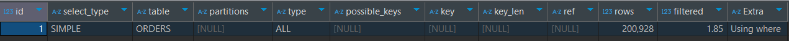
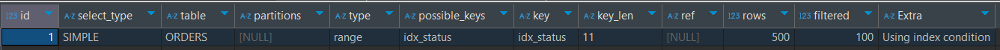
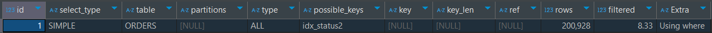
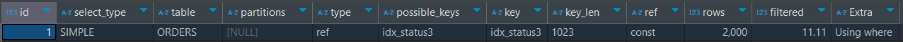

# Index 활용하기

## 목표

- 자주 조회하는 쿼리와 복잡한 쿼리를 EXPLAIN으로 분석한다.
- 조회 성능이 안좋은 쿼리에 Index를 활용해 성능 향상시킨다.

### 주의할 점
- Explain의 rows, filtered 등은 예상 값으로 정확하지 않을 수 있습니다.
- 카디널리티는 쌓이는 데이터 종류에 따라 비율이 변할 수 있습니다.
- 옵티마이저는 쌓이는 데이터 종류에 따라 인덱스, 힌트 선택이 변할 수 있습니다.

## Index 적용하기

인덱스를 적용할 수 있는 곳이 여러군데 있는데 다양하게 활용할 수 있는 `취소 대상 주문 조회`를 중점적으로 확인해보겠습니다.

### 취소 대상 주문 조회

주문 완료 이후 `15분` 이 지나도 결제가 되지 않은 주문(`INIT`)을 조회합니다.

### 데이터 셋팅
총 약 20만개의 데이터를 셋팅했으며 주문완료가 가장 많을 것으로 판단했습니다. 주문 성공시 `INIT`, 결제 성공시 `ORDER_COMPLETE`인데
결제를 시도중이거나 결제를 하지 않는 건들은 적을 것으로 판단해 2,000건을 준비했습니다. 주문완료된 2,000건 중 주문 생성시간 기준 결제 가능 
시간을 15분이상 넘긴 건들은 1,000건입니다.

| STATUS             | COUNT   |  
|--------------------|---------|  
| INIT               | 2,000   |
| ORDER_COMPLETE     | 10,000  |
| DELIVERY_PREPARE   | 10,000  |
| IN_DELIVERY        | 50,000  |
| DELIVERY_COMPLETE  | 12,9000 |
| 합계                 | 20,1000|

### sql문

```sql
SELECT * FROM ORDERS WHERE STATUS = 'INIT' AND CREATED_DATE < DATE_ADD(NOW(), INTERVAL - 15 MINUTE);
```

이 쿼리는 비지니스 측면에서 고민해 볼 점이 있습니다. 해당 배치는 매 분 주문 시간이 `15분` 이상 경과한
주문 건들을 체크하는데 시작 기준점이 없습니다. 즉, 이전에 조회되는 데이터들이 또 다시 조회 될 수 있습니다. 이는 불필요한 조회 및 변경
비용을 발생시키므로 최대 `1달 이전`의 주문건을 조회하도록 조건을 추가해 부하를 줄일 수 있습니다.

`created_date`에 시작 조건을 추가하여 다시 테스트 해보겠습니다.
(갯수를 비교하기 위해 `INIT` 상태의 주문은 2달 전 주문이 500건, 하루 전 주문이 500건 입니다.)

```sql
SELECT * FROM ORDERS WHERE STATUS = 'INIT' CREATED_DATE > DATE_ADD(NOW(), INTERVAL - 1 MONTH) AND CREATED_DATE < DATE_ADD(NOW(), INTERVAL - 15 minute) ;
```

### 1. 인덱스가 없는 경우



```sql
-> Filter: ((orders.`status` = 'INIT') and (orders.created_date < <cache>((now() + interval -(15) minute))))  
(cost=18811 rows=6652) (actual time=0.116..314 rows=1000 loops=1)
    -> Table scan on orders  (cost=18811 rows=199574) (actual time=0.0976..270 rows=201000 loops=1)
```
- `type: ALL`: 전체 행 스캔, 테이블의 데이터 전체 접근
- `extra: Using where`: 테이블에서 행을 가져온 후 추가적으로 검색조건을 적용해 행의 범위를 축소

결과는 `Full scan` 입니다. 인덱스가 없기 때문이며 풀스캔 이후  Where 조건절을 확인합니다. 모든 데이터를 조회하기 때문에 비효율적입니다. 

### 2. (status, created_date) 인덱스 추가



```sql
-> Index range scan on ORDERS using idx_status over (status = 'INIT' AND '2024-10-14 20:12:22.000000' < created_date < '2024-11-14 19:57:22.000000'), 
with index condition: ((orders.`status` = 'INIT') and (orders.created_date > <cache>((now() + interval -(1) month))) and (orders.created_date < <cache>((now() + interval -(15) minute))))  
(cost=225 rows=500) (actual time=0.0918..1.5 rows=500 loops=1)
```

- `type: range`: 인덱스 특정 범위의 행에 접근
- `extra: Using index condition`: 인덱스 컨디션 pushdown(ICP) 최적화가 일어났음을 표시

결과는 `Index range scan` 입니다. 첫번째 인덱스 칼럼인 `status`를 기준으로 하였고 두번째 인덱스 칼럼인 `created_date`을 이용했습니다.

### 3. (created_date, status) 인덱스 추가



```sql
-> Filter: ((orders.`status` = 'INIT') and (orders.created_date > <cache>((now() + interval -(1) month))) and (orders.created_date < <cache>((now() + interval -(15) minute))))  
(cost=20229 rows=16744) (actual time=0.0886..207 rows=500 loops=1)
    -> Table scan on ORDERS  (cost=20229 rows=200928) (actual time=0.0727..176 rows=201000 loops=1)
```

- `type: ALL`: 전체 행 스캔, 테이블의 데이터 전체 접근
- `extra: Using where`: 테이블에서 행을 가져온 후 추가적으로 검색조건을 적용해 행의 범위를 축소

결과는 `Full scan` 입니다. 인덱스 칼럼을 첫번째가 `created_date` 인데 옵티마이저는 인덱스를 활용하는 대신 풀스캔을 선택했습니다.
풀스캔 이후 Filter로 `INIT`을 먼저 확인합니다. 사실상 인덱스가 없는 경우와 비슷합니다. 인덱스 칼럼의 순서만 바꿨을 뿐인데 결과는 다를 수 있습니다. 

### 4. (status) 인덱스 추가



- `type: ref`: 인덱스로 동등조건으로 검색
- `ref: const`: 비교조건으로 어떤 값이 사용되었는지 명시(여기서는 `status=INIT`)
- `extra: Using where`: 테이블에서 행을 가져온 후 추가적으로 검색조건을 적용해 행의 범위를 축소

```sql
-> Filter: ((orders.created_date > <cache>((now() + interval -(1) month))) and (orders.created_date < <cache>((now() + interval -(15) minute))))  
(cost=522 rows=222) (actual time=0.206..6.16 rows=500 loops=1)
    -> Index lookup on ORDERS using idx_status3 (status='INIT')  (cost=522 rows=2000) (actual time=0.193..5.75 rows=2000 loops=1)
```

결과는 `lookup` 입니다. `status=INIT`으로 등가비교를 합니다. 그 이후에 where 조건절에서 추가로 `created_date`를 확인합니다.

### 결과

| 인덱스 조건               | type    | ref   | key         | rows   | filtered | Extra               | EXPLAN ANALYZE times |
|----------------------|---------|-------|-------------|--------|----------|---------------------|----------------------|
| NULL                 | ALL     | NULL  | NULL        | 200,807 | 3.33     | Using where         | 0.439s               |
| status, created_date | range   | NULL  | idx_status  | 500    | 100      | Using index condition | 0.138s               |
| created_date, status | ALL     | NULL  | idx_status2 | 200,928 | 8.33     | Using where         | 0.472s               |
| status               | ref     | const | idx_status3 | 2,000  | 11.11    | Using where         | 0.101s               |

만약 3개의 인덱스가 모두 사용되고 있다면 옵티마이저는 최종적으로 `index_status(status, created_date)`를 사용합니다. 인덱스를
`range`로 가장 효율적으로 사용하며 rows도 조회하고 싶은 갯수를 100% 조회합니다.

- 인덱스 조건의 성능 비교
```sql
(status, created_date) > (status) > (created_date, status) > NULL
```

`status`와 `created_date`의 순서만 바껴도 인덱스의 사용 방법이 달라지며 사실상 `idx_status2`는 인덱스가 없는 것과 성능이 비슷합니다.

`status`를 첫번째 칼럼으로 둔 이유는 데이터 종류 자체는 적어 카디널리티가 낮을 수도 있으나 주문 이후 결제 직전이거나 결제를 하지 않은 경우가
굉장히 적을 것이라고 생각했기 때문입니다. 그래서 데이터를 만들 때 `INIT(주문시작)`을 거의 1%만 설정헀습니다.

#### 배운점
- 여러 개의 인덱스를 생성해 `EXPLAIN`, `ANALYZE`를 통해 성능 검사를 하고 선택할 수 있다
- 카디널리티를 고려해 인덱스의 순서를 정한다
- 인덱스 순서를 바꾸는 것만으로 성능이 좋아질수도, 나빠질 수도 있다
- 추가되는 데이터에 따라 옵티마이저의 인덱스 선정이 달라질 수 있다

#### 아쉬운 점
- JOIN, 긴 쿼리, 페이징 등 복잡한 경우를 적용하지 못했다
- OS캐시, 쿼리 캐시 등을 초기화하면서 정밀한 속도 테스트를 못했다