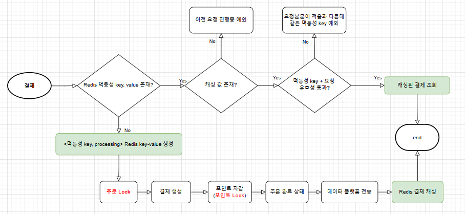
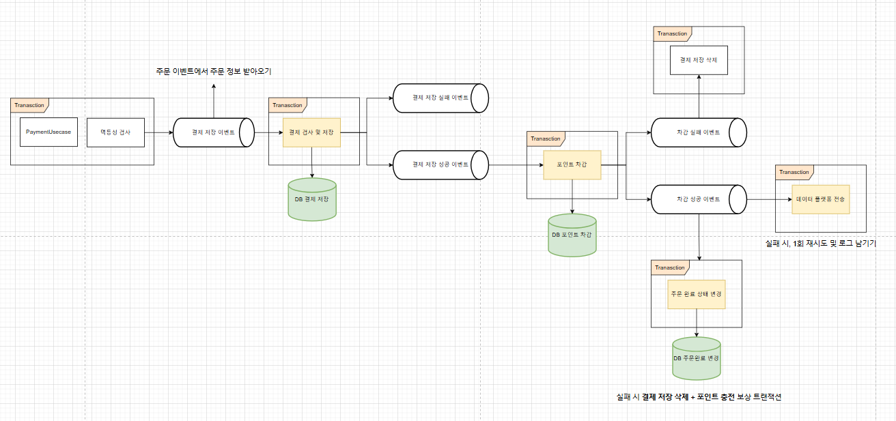

# 트랜잭션 개선하기

## 목표

- 개발한 기능의 트랜잭션 범위를 이해한다.
- 서비스의 규모가 확장된다면 서비스들의 트랜잭션 한계와 해결방안을 작성한다.

## 결제 트랜잭션 구조

 결제는 도메인 별로 `주문 조회`, `결제 생성`, `포인트 차감`, `주문완료 상태 변경` 4개의 트랜잭션이 필요합니다. 현재 하나의 트랜잭션
안에서 작동하기 때문에 예외가 발생하면 나머지 작업은 진행하지 않거나 이전 작업은 롤백됩니다. 멱등성 키와 캐싱은 자동 롤백 없이
레디스를 활용하여 직접 삽입/삭제를 구현합니다. 

## 서비스 규모에 따른 확장성

 서비스 규모가 확장되어 도메인 별로 서버가 나누어지면 이벤트 발행/구독 및 보상 트랜잭션 처리가 필요합니다. 현재 프로젝트 기준으로
 각 트랜잭션의 개선점을 확인해보도록 하겠습니다.

### 주문 조회

 주문 취소와 결제 모두 주문의 상태를 변경하는 작업이 있기 때문에 동시성 문제가 일어날 수 있습니다. 따라서 동시성을 제어해야하며,
현재는 비관 락으로 구현되어 있으나 분산 서버를 대비하여 락을 한곳에서 관리하며 DB의 부하를 줄일 수 있는 분산 락을 사용합니다.
해당 주문 정보는 결제 시, 유효성 검사를 위해 활용합니다.

#### 개선 포인트
- 비관락을 분산락으로 전환

### 결제 생성

 유효성 검사를 통해 결제 정보가 정상 생성되면 정상 결제 이력을 추가합니다. 하지만 이후 `포인트 차감`, `주문완료 상태 변경` 에서
예외가 발생해 롤백이 된다면 부모 트랜잭션에 의해 자동으로 이력이 삭제됩니다. 하지만 분산 서버에서는 자동 롤백이 되지 않으므로
결제 삭제를 추가합니다.

#### 개선 포인트
- 결제 삭제 보상 트랜잭션 추가

### 포인트 차감

 만약 포인트 충전/사용이 외부 모듈이라면, 차감 된 금액은 되돌릴 수 없습니다. 따라서 최대한 오류가 많을 것으로 예상되는 로직들을 미리
앞에서 처리하여 포인트에 보상 트랜잭션이 발생되지 않도록 위험을 최소화합니다. 그럼에도 이후 `주문 완료`에서 문제가 생긴다면
포인트 충전이 필요합니다.

#### 개선 포인트
- 포인트 충전 보상 트랜잭션 추가

## 해결방안 서비스 설계

 
최초에는 하나의 메서드에 모든 트랜잭션이 묶여 있었지만 이벤트 기반으로 도메인 별로 비지니스 로직을 요청하고 성공/실패에 따라 이벤트를 발행/구독합니다.

성공하는 경우와 실패하는 경우에 따라 이벤트 발행이 달라지며 보상 트랜잭션이 필요한지 아닌지 잘 고민해야 합니다. 예를 들어,
포인트 차감은 이후 문제가 생기면 `포인트 충전 보상 트랜잭션`이 필요하지만, 데이터 플랫폼 전송은 비지니스 로직의 메인이 아니므로
문제가 생겨도 결제를 취소하지 않고 `다시 데이터 전송 시도` 및 `로그`를 찍는 것으로 대체합니다.

#### 장점
- 거대하게 묶여있던 트랜잭션 범위를 Event 기반으로 짧게 분리할 수 있다.
- 각 모듈별로 책임을 가지고 있어 관심사 분리가 쉬워진다.

#### 단점
- 코드가 흩어져 한번에 흐름을 이해하기 어려워진다.
- 이벤트 기반은 데이터 유실 가능성이 있어 정합성이 안맞을 수 있다.

#### 추가 고려사항

그림에 표현되지 않은 부분과 개선할 부분은 다음과 같습니다.

- 결제 유효성 검사를 위해 주문의 정보가 필요하므로 주문에 이벤트를 발행하여 주문정보를 가지고 결제 서버로 간다.
- 결제 유효성 검사와 결제 데이터 저장을 먼저하는 이유는 포인트 차감의 보상 트랜잭션 문제 때문인데 결제 정보가 생성된 채로
이후에 예외가 생기면 결제 정보를 다시 삭제한다.(모든 결제 과정이 끝나야 데이터가 생기도록 한다.)
- 멱등성 검사 이후 예외가 발생하면 멱등성 키에 해당하는 Redis 데이터를 초기화한다.