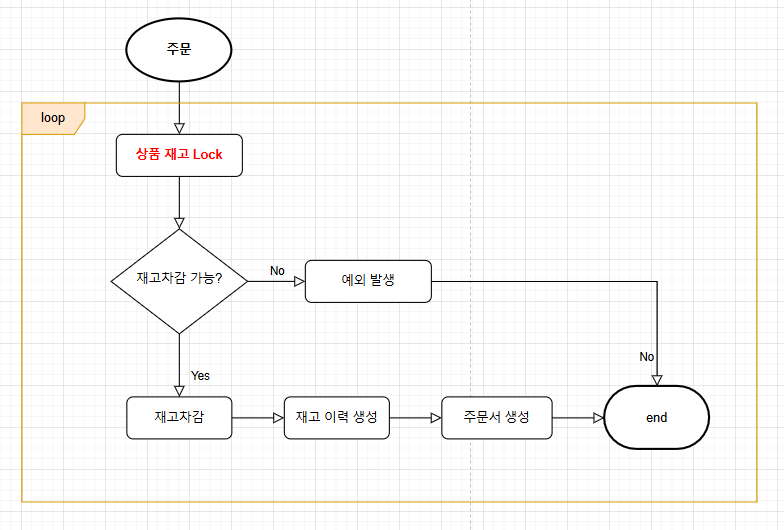
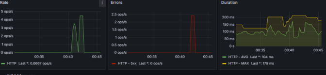
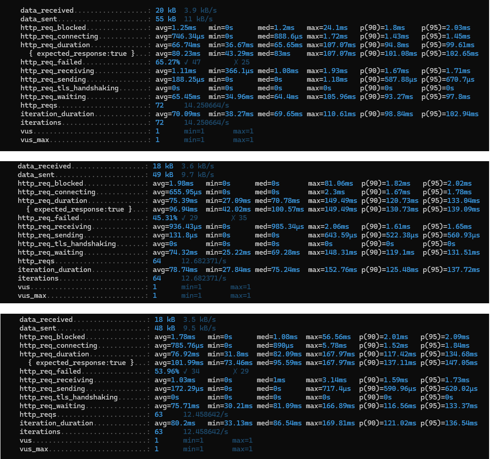
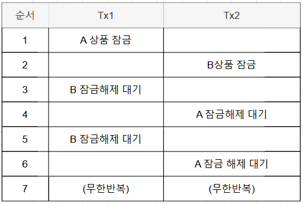

# 부하 테스트 시나리오

## 목표

- 프로젝트의 API 중 부하 테스트가 필요한 API를 선정한다.
- 성능 테스트 도구를 활용해 부하 테스트 및 시나리오 계획을 세우고 문서를 작성한다.

## 테스트 API 선정

### 프로젝트 API 현황 및 선택
 현재 프로젝트는 크게 장바구니, 상품, 주문, 결제, 포인트 5개의 도메인으로 구성되어 있습니다. 1개의 도메인 조회, 생성, 수정, 삭제 등의 
단순한 API도 있고, 다양한 비지니스 결합된 복잡한 API도 있습니다.

이커머스에서 가장 중요한 부분은 `주문`과 `결제`입니다. 현재 프로젝트에서 주문과 결제는 분리되어 있습니다. 결제는 이벤트를 활용해 개선을 
해보았기 때문에, 이번 주차는 주문을 테스트 해보겠습니다.

## 주문 API 흐름

주문 API는 크게 2가지 작업이 있습니다.

- 재고차감
- 주문서 작성

주문 요청 상품은 1개 이상일 수 있으며, 동시성 문제를 예방하고자 비관락을 사용하였고, 재고가 없는 경우 예외가 발생합니다. 



## 테스트 시나리오

시나리오: 동시에 여러 개의 인기 상품을 주문하여 정상적으로 재고차감 및 주문이 되는지 테스트합니다.  
테스트 주요 기준: 실패율, 응답시간, 병목구간을 중점적으로 테스트하여 안정적인 주문 환경을 구성합니다. 
테스트도구: K6

### 테스트 스크립트

다양한 순서로 주문을 하는 가상 유저 API 3개를 동시에 실행합니다.
```
TX1 => (A 상품 1개, B 상품 2개, C 상품 3개)
TX2 => (C 상품 3개, B 상품 2개, A 상품 1개)
TX3 => (B 상품 2개, C 상품 3개, A 상품 1개)
```

`TX1`, `TX2`, `TX3`은 각각 주문을 의미하며 A, B, C 상품을 동시에 주문 요청합니다.

- k6 스크립트

3명의 사용자가 `orderItemList`의 순서만 바꿔 주문을 요청합니다.

```javascript
import http from 'k6/http';
import { sleep } from 'k6';

export const options = {
  stages: [
    { duration: '5s', target: 1 }
  ]
};

export default function () {
  const url = 'http://localhost:8080/api/v1/orders/p/n/s';

  const params = {
    headers: {
      'customerId': 1,
      'Content-Type': 'application/json',
    },
  };

  const payload = JSON.stringify({
    receiverCity: '서울',
    receiverStreet: '회나무로',
    receiverZipcode: '123',
    orderItemList: [
      {
        orderCount: 1,
        itemId: 1,
        itemName: '코트',
        itemPrice: 1,
        orderItemOption: {
          itemOptionId: 1,
          itemOptionSize: '100',
          itemOptionColor: 'red',
          itemOptionPrice: 0
        }
      },
      {
        orderCount: 2,
        itemId: 2,
        itemName: '니트',
        itemPrice: 2,
        orderItemOption: {
          itemOptionId: 2,
          itemOptionSize: '105',
          itemOptionColor: 'green',
          itemOptionPrice: 0
        }
      },
      {
        orderCount: 3,
        itemId: 3,
        itemName: '바지',
        itemPrice: 3,
        orderItemOption: {
          itemOptionId: 3,
          itemOptionSize: '32',
          itemOptionColor: 'blue',
          itemOptionPrice: 0
        }
      }
    ]
  });

  const res = http.post(url, payload, params);
  console.log(res.body);
}

```

## 테스트 실행 및 결과

### 테스트 실행

k6로 3개의 테스트를 동시에 실행합니다.
```sql
> k6 run order_1.js
> k6 run order_2.js
> k6 run order_3.js
```

### 테스트 결과





- 실패율(%): `65.27%`, `45.31%`, `53.96%`
- 평균 응답 시간 (avg): `66.74ms`, `75.39ms`, `76.92ms` 
- 최소 응답 시간 (min): `36.97ms`, `27.09ms`, `31.8ms` 
- 최대 응답 시간 (max): `107.07ms`, `149.49ms`, `167.97ms`
- p90: `94.8ms`, `120.73ms`, `117.42ms`
- p95: `99.61ms`, `133.04ms`, `134.68ms`

### 데드락 문제

- 동시에 3개의 상품에 다양한 주문 요청을 했는데 실패율이 무려 50%가 넘었습니다.  
- 재고를 동시에 차감하려고 하니 데드락(교착상태)에 빠지는 문제가 발생했습니다.



