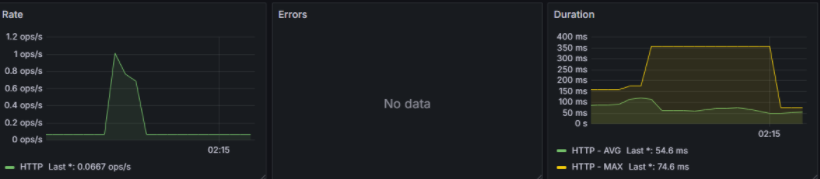
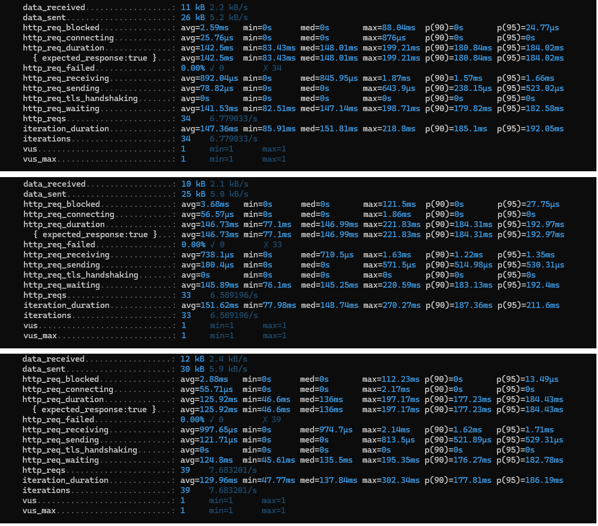
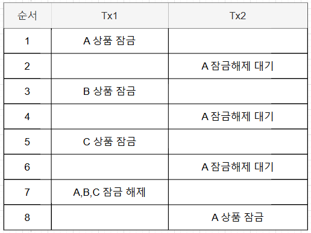
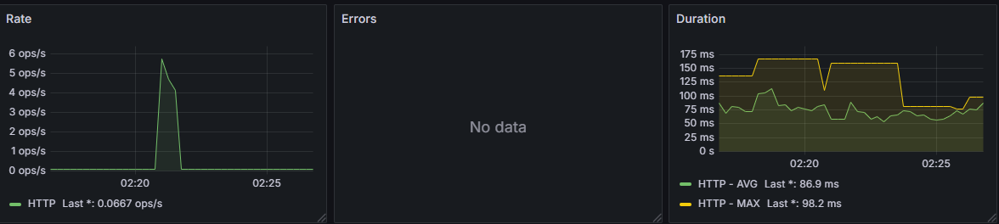
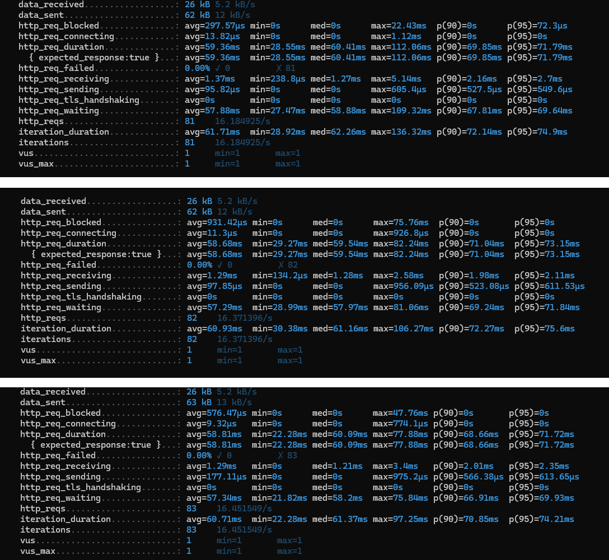

# 주문 병목 문제 해결하기

## 목표

- 주문 시 발생하는 데드락 문제를 해결한다.
- 데드락 문제 해결 이외에 성능을 개선할 수 있는 방법을 확인한다.

## 데드락 해결 방법
데드락을 해결할 수 있는 방법들은 다양합니다.

- 트랜잭션 단위를 상품 하나로 제한하고 Queue 사용
- 비관락을 사용해 고객이 재시도하도록 유도
- Redis 사용
- 상품 정렬

여러가지 선택지 중 상품 정렬을 먼저 시도했습니다. 정렬을 통해 순환 대기를 제거할 수 있고 잠금에 순서가 있기 때문에 데드락을 예방할 수 있습니다.
무엇보다 간단한 코드 수정만으로도 좋은 효과를 기대할 수 있습니다.

### 재고차감 정렬
재고를 차감할 때 `itemId` 를 기준으로 오름차순을 정렬하고 재고를 차감합니다.
```java
@Transactional
public OrderInfo.CreateResponse orderPessimisticLock(OrderCommand.OrderRequest request) {
    // 재고 차감(itemId 오름차순)
    request.getOrderItemList().stream()
            .sorted(Comparator.comparing(OrderCommand.OrderItemRequest::getItemId))
            .forEach(orderItemRequest -> {
                var orderItemOption = orderItemRequest.getOrderItemOption();

                itemStockService.decreaseStockPessimistic(
                        orderItemOption.getItemOptionId(),
                        Long.valueOf(orderItemRequest.getOrderCount())
                );
            });

    //주문 저장
    return orderCreateService.createOrder(request);
}
```

### 테스트 스크립트
동일한 정렬 순서로 주문을 하는 가상 유저 API 3개를 동시에 실행합니다.
```
TX1 => (A 상품 1개, B 상품 2개, C 상품 3개)
TX2 => (A 상품 1개, B 상품 2개, C 상품 3개)
TX3 => (A 상품 1개, B 상품 2개, C 상품 3개)
```

## 테스트 실행 및 결과

### 테스트 실행

k6로 3개의 테스트를 동시에 실행합니다.(이전과 동일)
```sql
> k6 run order_1.js
> k6 run order_2.js
> k6 run order_3.js
```

### 테스트 결과





- 실패율(%): `0%`, `0%`, `0%`
- 평균 응답 시간 (avg): `142.25ms`, `146.73ms`, `125.92ms` 
- 최소 응답 시간 (min): `83.43ms`, `77.1ms`, `46.6ms` 
- 최대 응답 시간 (max): `199.21ms`, `221.83ms`, `177.23ms`
- p90: `180.84ms`, `184.31ms`, `177.23ms`
- p95: `184.02ms`, `192.97ms`, `184.43ms`

### 데드락 문제 해결

- 정렬 순서를 바꾼 것만으로도 모든 주문 요청이 성공하여 실패율이 `0%`로 개선 되었습니다.  
- 전반적으로 응답속도는 증가했지만, 수많은 동시요청이 모두 성공했으므로 병목 현상이 해소되었습니다. 



TX1에서 A, B, C를 모두 잠금했지만 다른 트랜잭션들은 무조건 A를 대기하므로 데드락을 해결했습니다.

## 성능 개선하기

### Redis로 재고 차감하기

추가적으로 DB에 비관락을 사용하는 것이 아닌, Redis로 재고를 관리하고 싱크를 맞추는 방법을 사용합니다.

```java
@Transactional
public Long decreaseStockRedis(Long itemOptionId, Long quantity, Long permitQuantity) {
    String key = itemOptionId + ":stock";
    String value = (redisTemplate.opsForValue().get(key));
    Long orderedQuantity = value == null ? 0 : Long.parseLong(value);
    if (orderedQuantity + quantity >= permitQuantity) {
        throw new IllegalStatusException(ErrorCode.ITEM_STOCK_INSUFFICIENT);
    }

    redisTemplate.opsForValue().increment(key, quantity);

    itemStore.createItemInventoryHistory(ItemInventoryHistory.createMinus(itemOptionId, quantity));

    return permitQuantity - orderedQuantity;
}
```

## 테스트 실행 및 결과

### 테스트 실행

k6로 3개의 테스트를 동시에 실행합니다.(이전과 동일)
```sql
> k6 run order_1.js
> k6 run order_2.js
> k6 run order_3.js
```

### 테스트 결과





- 실패율(%): `0%`, `0%`, `0%`
- 평균 응답 시간 (avg): `59.36ms`, `58.68ms`, `58.81ms`
- 최소 응답 시간 (min): `28.55ms`, `29.27ms`, `22.28ms`
- 최대 응답 시간 (max): `112.06ms`, `82.24ms`, `77.88ms`
- p90: `69.85ms`, `71.04ms`, `68.66ms`
- p95: `71.79ms`, `73.15ms`, `71.72ms`

### 속도 성능 향상

- Redis를 사용햐여 재고를 관리하므로 직전 대비 성능이 `50%` 이상 올라갔습니다. 
- 인기상품의 경우 빠르게 재고가 소진 될 것을 예상해 Redis 재고 관리를 검토할 수 있습니다.

## 최종 결과

| 구분             | 일반 주문    | 상품 정렬 주문 | 상품 정렬 + Redis 재고 주문 |
|----------------|----------|----------|---------------------|
| 실패율(%)         | 54.84%   | 0%       | 0%                  |
| 평균 응답 시간 (avg) | 76.68ms  | 138.3ms  | 58.95ms             |
| 최소 응답 시간 (min) | 31.95ms  | 69.04ms  | 27.6ms              |
| 최대 응답 시간 (max) | 141.51ms | 199.42ms | 90.72ms             |
| p90            | 110.98ms | 180.79ms | 69.85ms             |
| p95            | 122.44ms | 187.14ms | 72.22ms             |

- 상품 정렬을 통해 실패율을 `0%`로 개선했습니다.
- 상품 재고를 DB가 아닌 Redis를 사용하여 빠르게 연산을 하도록 개선했습니다.